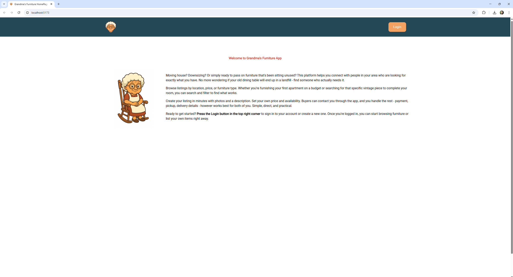
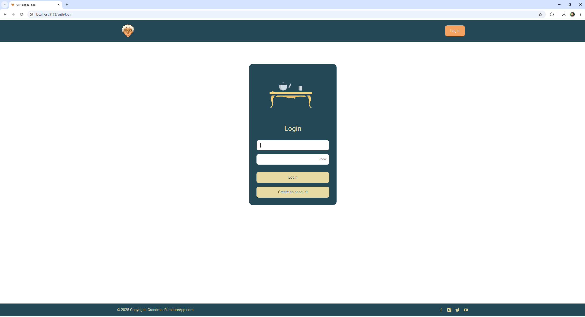
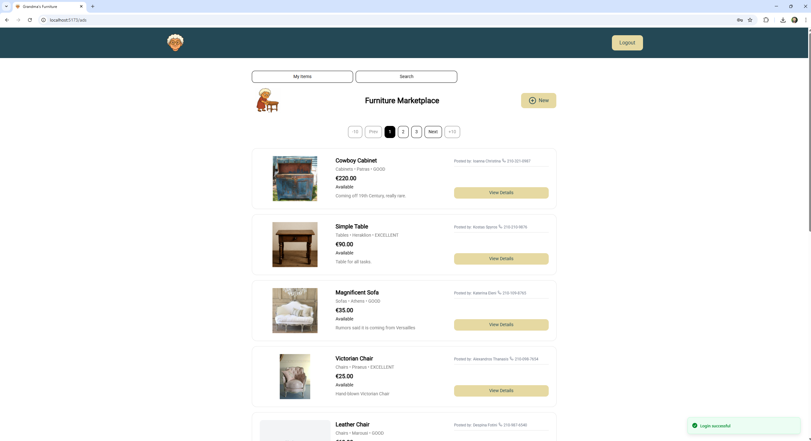
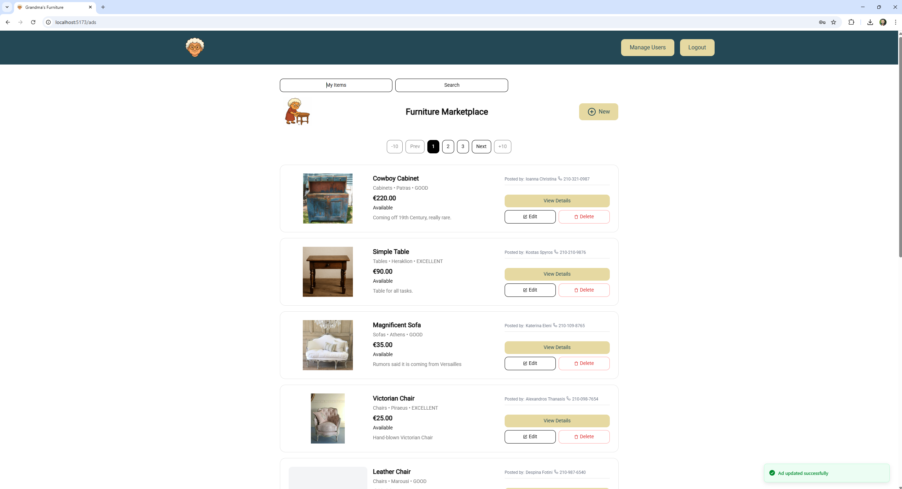
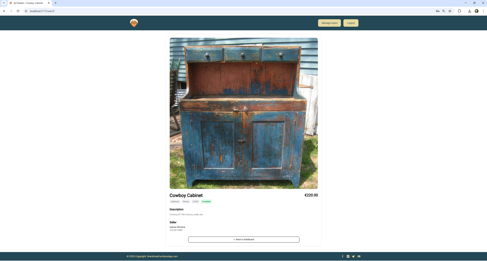
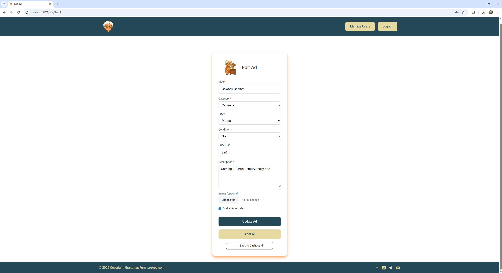
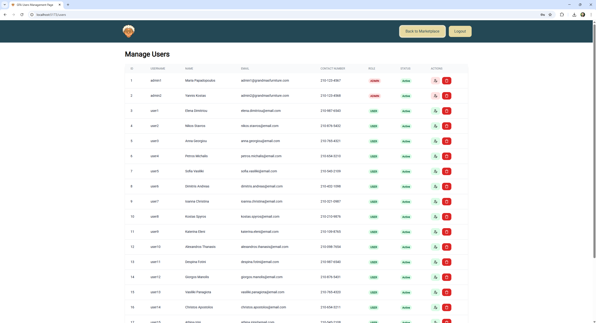
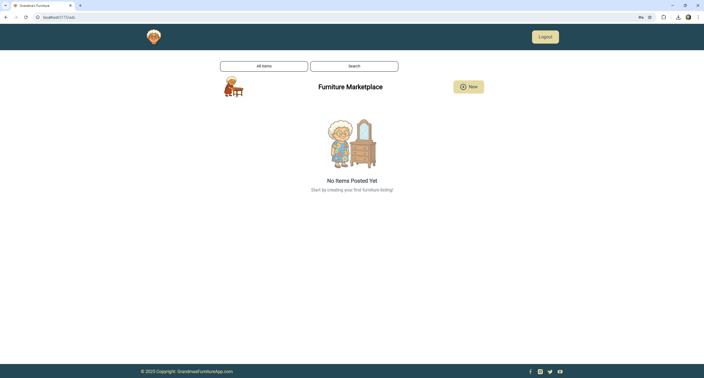
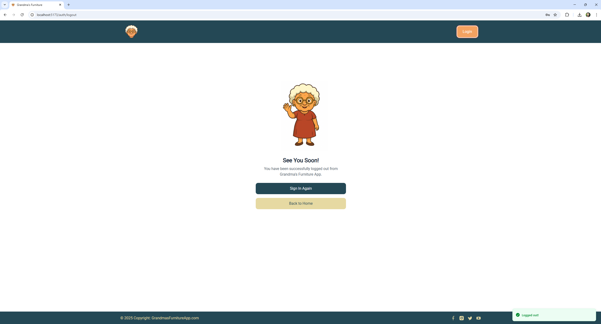

# Grandma's Furniture App  

A full-stack furniture marketplace application built with Spring Boot and React. Users can buy, sell, and browse antique furniture with advanced search capabilities, image uploads, and role-based access control.


## 🏗️ Architecture Overview

This project consists of two main components:

- **Backend**: Spring Boot REST API with JWT authentication
- **Frontend**: React TypeScript application with modern UI components

```
grandmas-furniture-app/
├── grandmas-furniture-app-backend/       # Spring Boot Backend
│   ├── src/main/java/                   # Java source code
│   ├── src/main/resources/              # Configuration files
│   ├── build.gradle                     # Gradle build configuration
│   └── README.md                        # Backend documentation
├── grandmas-furniture-app-frontend/      # React Frontend
│   ├── src/                             # React source code
│   ├── package.json                     # Node.js dependencies
│   ├── vite.config.ts                   # Vite configuration
│   └── README.md                        # Frontend documentation
└── README.md                            # This file
```

## 🚀 Quick Start

### Prerequisites

- **Java 17** or higher
- **Node.js 18** or higher
- **MySQL 8.0** or higher
- **Gradle 7.0** or higher
- **npm, yarn, or pnpm**

### 1. Clone the Repository

```bash
git clone <repository-url>
cd grandmas-furniture-app
```

### 2. Database Setup

#### Option 1: Quick Setup with SQL File (Recommended)
```bash
# Connect to MySQL
mysql -u root -p

# Run the complete database setup script
source grandmas-furniture-app-backend/src/main/resources/mysql/schema\ query.sql;
```

#### Option 2: Manual Setup
```bash
# Connect to MySQL
mysql -u root -p

# Create database and user
CREATE DATABASE grandmas_furniture_app;
CREATE USER 'furniture_user'@'localhost' IDENTIFIED BY 'your_password';
GRANT ALL PRIVILEGES ON grandmas_furniture_app.* TO 'furniture_user'@'localhost';
FLUSH PRIVILEGES;
```

**Note:** The SQL file automatically creates:
- Database: `grandmasfurnitureappdb`
- User: `Giannis` with password `12345`
- All tables with proper structure
- Sample categories and cities
- Test users (including admin1/user1 with password `Cosmote1@`)
- Sample furniture ads

### 3. Backend Configuration

```bash
cd grandmas-furniture-app-backend

# Update application.properties with your database credentials
# Edit: src/main/resources/application.properties
```

```properties
# Database Configuration
# If using SQL file setup (recommended):
spring.datasource.url=jdbc:mysql://localhost:3306/grandmasfurnitureappdb
spring.datasource.username=Giannis
spring.datasource.password=12345

# If using manual setup:
# spring.datasource.url=jdbc:mysql://localhost:3306/grandmas_furniture_app
# spring.datasource.username=furniture_user
# spring.datasource.password=your_password

# JWT Configuration
jwt.secret=your_jwt_secret_key_here
jwt.expiration=86400000
```

### 4. Start the Backend

```bash
cd grandmas-furniture-app-backend
./gradlew bootRun
```

The backend will start on `http://localhost:8080`

#### Troubleshooting: Missing gradle-wrapper.jar

If you encounter an error about missing `gradle-wrapper.jar`, download it:

```bash
cd grandmas-furniture-app-backend/gradle/wrapper
curl -L -o gradle-wrapper.jar https://raw.githubusercontent.com/gradle/gradle/v8.14.3/gradle/wrapper/gradle-wrapper.jar
```

This downloads the official Gradle wrapper jar for version 8.14.3 (as specified in gradle-wrapper.properties).

### 5. Frontend Configuration

```bash
cd grandmas-furniture-app-frontend

# Install dependencies
npm install
npm install lucide-react@latest

# Create environment file
echo "VITE_API_URL=http://localhost:8080/api" > .env.local
```

### 6. Start the Frontend

```bash
cd grandmas-furniture-app-frontend
npm run dev
```

The frontend will start on `http://localhost:5173`

## 🔐 Test Accounts

Use these credentials to test the application:

| Role | Username | Password | Access Level |
|------|----------|----------|--------------|
| **Admin** | `admin1` | `Cosmote1@` | Full system access |
| **User** | `user1` | `Cosmote1@` | Personal ads only |

## ✨ Key Features

### 🪑 Furniture Marketplace
- **Browse & Search**: Advanced filtering by title, price, location, and condition
- **Smart Context**: "All Items" vs "My Items" with automatic user filtering
- **Image Management**: Upload and manage furniture images
- **Real-time Updates**: Immediate feedback for all user actions

### 🔐 Security & Authentication
- **JWT Authentication**: Secure token-based authentication
- **Role-based Access**: Admin and User roles with appropriate permissions
- **Protected Routes**: Secure access to sensitive functionality
- **CORS Support**: Seamless frontend-backend communication

### 🔍 Advanced Search
- **Unified Search**: Single endpoint for all search operations
- **Server-side Filtering**: Efficient database queries with JPA specifications
- **Pagination**: Configurable page sizes and navigation
- **Smart Filtering**: Automatic user context and availability options

### 📱 User Experience
- **Responsive Design**: Works on all devices and screen sizes
- **Modern UI**: Built with Tailwind CSS and shadcn/ui components
- **Toast Notifications**: Real-time feedback and error handling
- **Loading States**: Smooth user experience with proper loading indicators

## 🛠️ Technology Stack

### Backend
- **Java 17** with Spring Boot 3.4.6
- **Spring Security** with JWT authentication
- **Spring Data JPA** with MySQL database
- **JPA Specifications** for dynamic query building
- **Gradle** for build management
- **OpenAPI 3** for API documentation

### Frontend
- **React 19** with TypeScript
- **Vite** for fast development and building
- **Tailwind CSS** for utility-first styling
- **shadcn/ui** for high-quality components
- **React Router 7** for client-side routing
- **Zod** for runtime type validation

## 📚 API Documentation

### Backend Endpoints

Once the backend is running, access the API documentation at:
- **Swagger UI**: `http://localhost:8080/swagger-ui/index.html`
- **API Base**: `http://localhost:8080/api`

### Key API Endpoints

```http
# Authentication
POST /api/auth/login          # User login
POST /api/auth/register       # User registration

# Ads Management
GET  /api/ads                 # Get paginated ads
POST /api/ads/save            # Create new ad with image
GET  /api/ads/{id}            # Get ad by ID
PUT  /api/ads/{id}            # Update ad
DELETE /api/ads/{id}          # Delete ad

# Advanced Search
POST /api/ads/search/paginated # Unified search with filters

# User Management
GET  /api/users               # Get users (admin only)
PUT  /api/users/{id}/role     # Update user role (admin only)
```

## 🔍 Search & Filtering

The application features a unified search system that works across all views:

### Search Filters
```json
{
  "title": "vintage chair",
  "categoryName": "Chairs",
  "cityName": "Athens",
  "condition": "GOOD",
  "minPrice": 50,
  "maxPrice": 500,
  "isAvailable": true,
  "myAds": false,
  "page": 0,
  "pageSize": 10,
  "sortBy": "id",
  "sortDirection": "asc"
}
```

### Smart Context
- **"All Items"**: Browse entire marketplace
- **"My Items"**: View and manage personal listings
- **Availability Toggle**: Show all items or only available ones

### Available Filter Options
- **Text Search**: `title`, `categoryName`, `cityName`
- **Condition Filter**: `condition` (EXCELLENT, GOOD, AGE_WORN, DAMAGED)
- **Price Range**: `minPrice`, `maxPrice`
- **Availability**: `isAvailable` (true/false)
- **User Context**: `myAds` (true for current user's ads only)
- **Pagination**: `page`, `pageSize`
- **Sorting**: `sortBy`, `sortDirection`

### Condition Values
- **EXCELLENT**: Like new condition
- **GOOD**: Good used condition  
- **AGE_WORN**: Shows signs of age but functional
- **DAMAGED**: Has visible damage or defects

## 🚀 Development

### Backend Development

```bash
cd grandmas-furniture-app-backend

# Run with specific profile
./gradlew bootRun --args='--spring.profiles.active=dev'

# Enable debug logging
./gradlew bootRun --args='--logging.level.gr.aueb.cf=DEBUG'

# Build and run
./gradlew build
java -jar build/libs/grandmasfurnitureapp-0.0.1-SNAPSHOT.jar
```

### Frontend Development

```bash
cd grandmas-furniture-app-frontend

# Development server
npm run dev

# Build for production
npm run build

# Preview production build
npm run preview

# Type checking
npm run type-check
```

### Testing

```bash
# Backend tests
cd grandmas-furniture-app-backend
./gradlew test

# Frontend tests (if configured)
cd grandmas-furniture-app-frontend
npm run test
```

## 📁 Project Structure

### Backend Structure
```
src/main/java/gr/aueb/cf/grandmasfurnitureapp/
├── authentication/           # JWT authentication services
├── config/                  # Application configuration
├── core/                    # Core components
│   ├── enums/              # Enums (Condition, Role)
│   ├── exceptions/          # Custom exceptions
│   ├── filters/             # Search filters and pagination
│   └── specifications/      # JPA specifications for filtering
├── dto/                     # Data Transfer Objects
├── mapper/                  # Entity-DTO mapping
├── model/                   # JPA entities
│   └── static_data/         # Static data (Category, City)
├── repository/              # Data access layer
├── rest/                    # REST controllers
├── security/                # Security configuration
└── service/                 # Business logic services
```

### Frontend Structure
```
src/
├── api/                     # API functions and service calls
│   ├── ads.ts              # Ad-related API calls
│   ├── login.ts            # Authentication API calls
│   ├── registration.ts     # User registration API calls
│   └── users.ts            # User management API calls
├── assets/                  # Static assets (images, icons, SVGs)
├── components/              # Reusable UI components
│   ├── ads/                # Ad-related components
│   │   ├── AdRowCard.tsx   # Individual ad display card
│   │   └── AdsTable.tsx    # Paginated ads table
│   ├── ui/                 # shadcn/ui components
│   │   ├── alert-dialog.tsx # Alert dialog component
│   │   ├── button.tsx      # UI button component
│   │   └── sonner.tsx      # Toast notifications
│   ├── AdminProtectedRoute.tsx # Admin route protection
│   ├── AuthButton.tsx      # Authentication button
│   ├── Button.tsx          # Custom button component
│   ├── Footer.tsx          # Application footer
│   ├── GrandmaLogo.tsx     # Logo component
│   ├── Header.tsx          # Navigation header
│   ├── Input.tsx           # Form input component
│   ├── Label.tsx           # Form label component
│   ├── Layout.tsx          # Page layout wrapper
│   ├── Pagination.tsx      # Pagination component
│   └── ProtectedRoute.tsx  # Route protection component
├── config/                  # Configuration files
│   └── constants.ts        # Application constants
├── context/                 # React context providers
│   ├── AuthContext.ts      # Authentication state
│   └── AuthProvider.tsx    # Auth provider component
├── hooks/                   # Custom React hooks
│   └── useAuth.ts          # Authentication hook
├── lib/                     # Utility functions and helpers
│   ├── cookies.ts          # Cookie management utilities
│   └── utils.ts            # General utility functions
├── pages/                   # Page components
│   ├── AdDetailedPage.tsx  # Individual ad details page
│   ├── AdPage.tsx          # Ad creation/editing page
│   ├── DashboardAdsPage.tsx # Main dashboard with search
│   ├── HomePage.tsx        # Application home page
│   ├── LoginPage.tsx       # User authentication page
│   ├── LogoutPage.tsx      # Logout confirmation page
│   ├── NotFoundPage.tsx    # 404 error page
│   ├── RegistrationPage.tsx # User registration page
│   └── UsersPage.tsx       # User management (admin only)
├── App.tsx                  # Main application component
├── index.css               # Global styles
├── main.tsx                # Application entry point
└── vite-env.d.ts           # Vite environment types
```

## 🔧 Configuration

### Database Setup Files
The project includes a complete database setup script located at:
```
grandmas-furniture-app-backend/src/main/resources/mysql/schema query.sql
```

This SQL file contains:
- **Complete database schema** with all tables and relationships
- **Sample data** including categories, cities, and furniture ads
- **Test users** with predefined credentials
- **Proper indexing** for optimal performance
- **Database user creation** with appropriate permissions

### Environment Variables

#### Backend
```properties
# Database
spring.datasource.url=jdbc:mysql://localhost:3306/grandmas_furniture_app
spring.datasource.username=furniture_user
spring.datasource.password=your_password

# JWT
jwt.secret=your_secret_key
jwt.expiration=86400000

# File Upload
spring.servlet.multipart.max-file-size=10MB
spring.servlet.multipart.max-request-size=10MB
```

#### Frontend
```env
# API Configuration
VITE_API_URL=http://localhost:8080/api

# Optional Development
VITE_DEBUG_MODE=true
VITE_LOG_LEVEL=info
```

## 🖼️ Screenshots

### Home Page


### Login


### Marketplace - User


### Marketplace - Admin


### Ad Details


### Create & Edit Ad


### Users Management


### My Items - Empty State


### Logout


## 🐛 Troubleshooting

### Common Issues

**Backend Won't Start**
- Verify MySQL is running and accessible
- Check database credentials in `application.properties`
- **Use the SQL file for quick database setup**: `grandmas-furniture-app-backend/src/main/resources/mysql/schema query.sql`
- Ensure Java 17+ is installed and in PATH
- **Missing gradle-wrapper.jar**: Download from GitHub (see Start Backend section above)

**Frontend Can't Connect to Backend**
- Verify backend is running on port 8080
- Check `VITE_API_URL` in `.env.local`
- Ensure CORS is configured in backend

**Search Not Working**
- Check backend logs for errors
- Verify search endpoint is accessible
- Test with simple filters first

**Authentication Issues**
- Clear browser cookies
- Check JWT token expiration
- Verify user credentials

### Debug Commands

```bash
# Backend debugging
./gradlew bootRun --args='--logging.level.gr.aueb.cf=DEBUG'

# Frontend debugging
# Check browser console and network tab
# Verify environment variables are loaded
```

## 📝 Recent Improvements

### v2.0 - Unified Search Architecture
- **Consolidated Search**: Single endpoint for all search operations
- **Smart Filtering**: Automatic user context for personal items
- **Better Performance**: Server-side filtering with JPA specifications
- **Cleaner Code**: Removed duplicate specifications and simplified logic
- **Enhanced UX**: Users can see all ads with clear availability indicators


## 📄 License

This project is licensed under the MIT License.

## 🔗 Quick Links

- **[Backend Documentation](./grandmas-furniture-app-backend/README.md)**
- **[Frontend Documentation](./grandmas-furniture-app-frontend/README.md)**
- **API Documentation**: `http://localhost:8080/swagger-ui/index.html`(when running)
- **Frontend App**: `http://localhost:5173` (when running)
- **Backend API**: `http://localhost:8080/api` (when running)

For additional help, check the individual README files in the backend and frontend directories.
